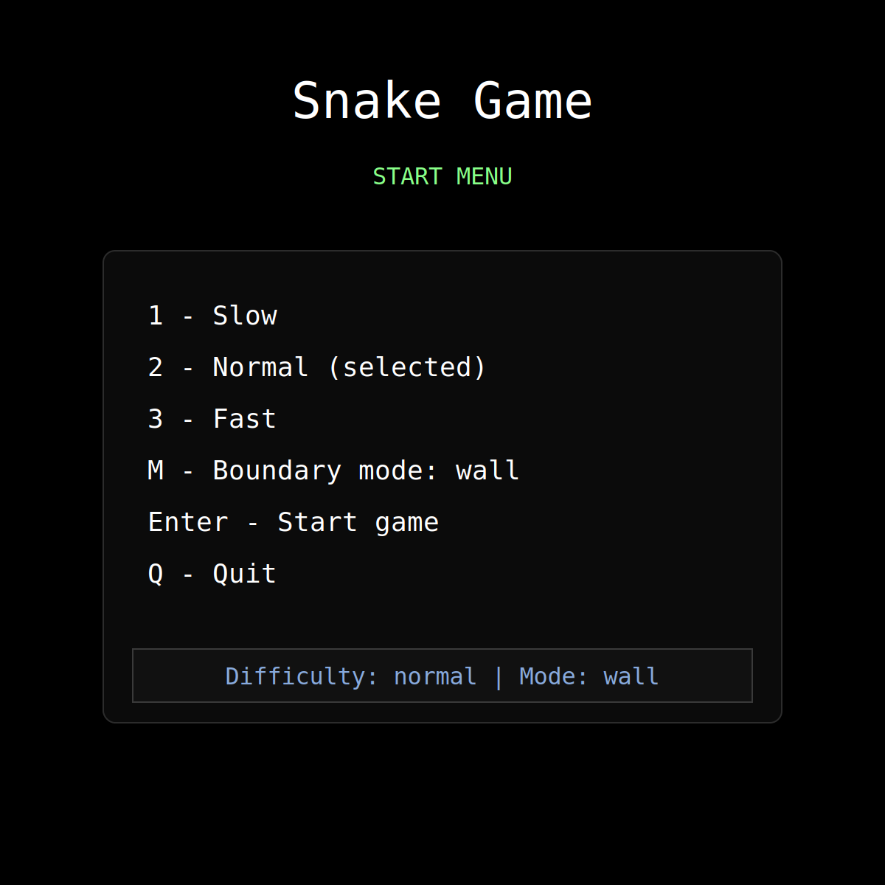
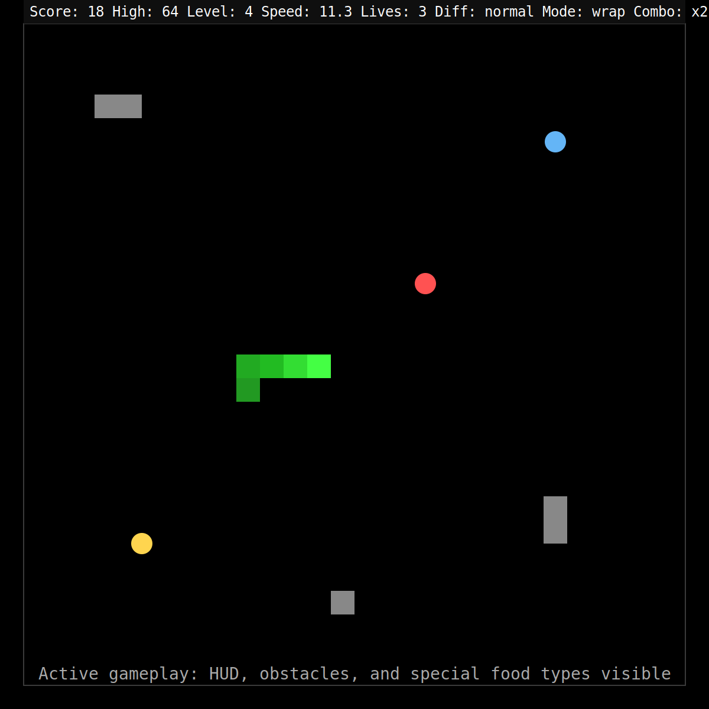
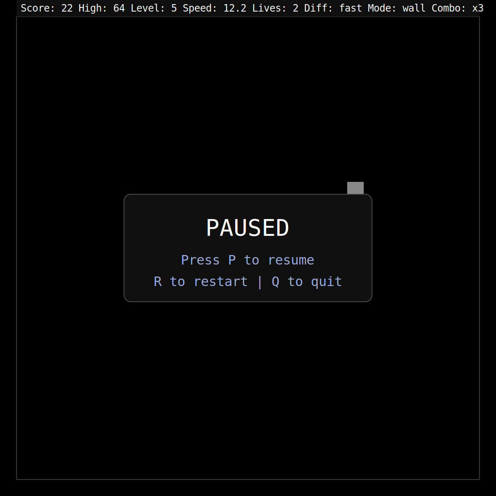
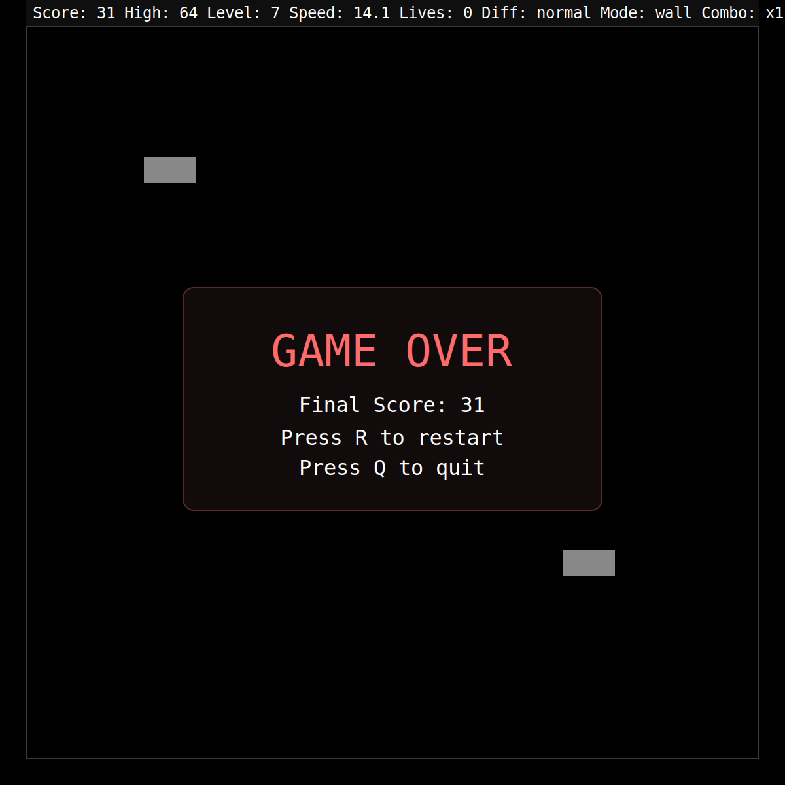

# Python Snake Game

A classic Snake game built with Python `turtle`, now extended with game states, difficulty settings, wrap/wall modes, HUD improvements, obstacles, combo scoring, and safer high-score persistence.

## Screenshots

### Start menu



### Gameplay (HUD + special food + obstacles)



### Paused state



### Game-over state



> Screenshot maintenance: refresh these images whenever HUD text, controls, color scheme, or game-state overlays change.

## Requirements

- Python 3.10+
- Standard library only (no external dependencies)

## Run the game

```bash
python main.py
```

## Controls

### Menu (Start State)
- `1` → Slow
- `2` → Normal
- `3` → Fast
- `M` → Toggle boundary mode (`wall` / `wrap`)
- `Enter` → Start game
- `Q` → Quit

### In Game
- Arrow keys → Move snake
- `P` → Pause/Resume
- `R` → Restart current run
- `Q` → Quit

### Game Over
- `R` → Restart
- `Q` → Quit

## Implemented upgrades

- Explicit game states: start, running, paused, game-over, exit
- In-game restart/quit controls (removed text prompt flow)
- Consistent playable boundaries + optional wrap-around mode
- Reliable high-score storage with fallback for missing/corrupt data
- Difficulty selection at start
- Dynamic speed scaling based on score (+ speed/slow food effects)
- HUD: score, high score, level, speed, lives, difficulty, mode, combo
- Special food types: normal, bonus, speed-up, slow-down
- Progressive obstacle spawning
- Lives system and combo multiplier scoring

## Test

```bash
python -m unittest discover -v
```

## Project files

- `main.py` - state-driven game loop and controls
- `snake.py` - snake entity behavior
- `food.py` - food spawning and types
- `obstacles.py` - obstacle manager
- `scoreboard.py` - HUD/menu/status rendering
- `high_score_store.py` - robust high-score persistence
- `game_logic.py` - pure gameplay logic utilities
- `config.py` - centralized constants and enums
